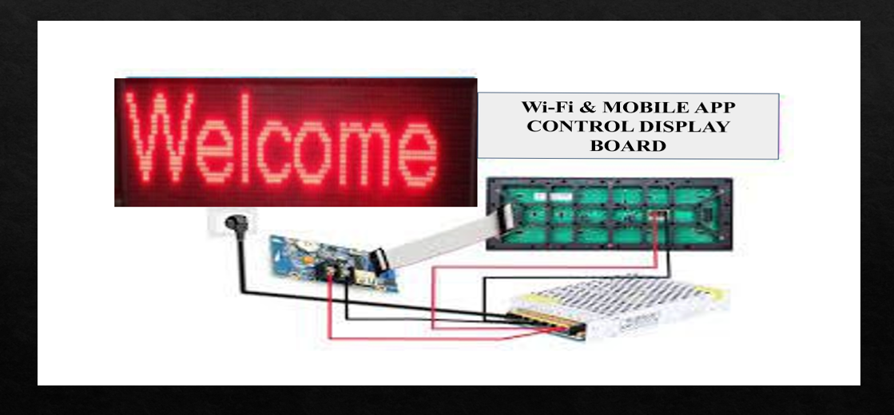

<!DOCTYPE html>
<html lang="en">
<head>
    <meta charset="UTF-8">
    <meta name="viewport" content="width=device-width, initial-scale=1.0">
</head>
<body>
    <h1>
        <b>Wi-Fi BASED WIRELESS ELECTRONIC NOTICE BOARD</b>
      </h1>
      <h1>INTRODUCTION</h1>
      <ol type="1" start="1">
        <li>
          Digital advertisements have become popular nowadays in shopping malls,
          super markets and airports.
        </li>
        <li>
          Over the last two decades the use of cell phones has been rapidly
          increasing.
        </li>
        <li>
          Mobile phones and the related technologies have become one of the most
          important things in this modern era.
        </li>
        <li>
          This drastic use of mobile phones gave the interesting idea of sending
          and receiving messages and the displaying them on digital board.
        </li>
        <li>
          The Wi-Fi facility in mobile handset enables us to send messages or
          notice using digital notice board
        </li>
      </ol>
      <h1>Objectives</h1>
      <ol type="1" start="1">
        <li>
          To develop a Wireless Notice board which access the messages in the form
          of text from Wi-Fi module .
        </li>
        <li>
          To replace the conventional notice boards by wireless digital displays
          driven by Wi-Fi technology.
        </li>
        <li>
          To design the system that can be used anywhere irrespective of the place
          of deployment providing Wi-Fi connectivity.
        </li>
        <li>
          To develop a less power consumable and easy to operate Notice board.
        </li>
      </ol>
      <h1>Hardware requirements</h1>
      <ol type="1" start="1">
        <li>SINGLE COLOR WI-FI CONTROL CARD</li>
        <li>RTC (REAL TIME CLOCK)</li>
        <li>TEMPERATURE SENSOR</li>
        <li>POWER SOURCE</li>
        <li>P10 LED Display</li>
      </ol>
      <h1>Software requirements</h1>
      <ol type="1" start="1">
        <li>LED ART App or Computer</li>
      </ol>
      <h1>Block diagram</h1>
      
      
<b>Fig 1: Block diagram of Wireless Notice Board</b>

      <ol type="1" start="1">
        <li>
          Figure.1:- shows the block diagram of the wireless notice board. It
          mainly consists of three parts: MOBILE PHONE, LED ART APPLICATION,
          SINGLE COLOUR Wi-Fi CONTROLLER CARD and P10 LED DISPLAY.
        </li>
        <li>
          Mobile applications: LED Art app will be installed in the mobile. Using
          the Wi-Fi in mobile, single colour Wi-Fi control card will be accessed
          using the Password and parameters will be set as per the requirements.
        </li>
        <li>
          Power supply: The power supply will connect the single colour Wi-Fi
          controller card.
        </li>
        <li>
          P10 led display: Whenever the message is sent by the authorized user
          from the mobile, it is transmitted through Wi-Fi module to the P10 LED
          Display.
        </li>
        <li>
          Single colour wi-fi controller card: The complete operation of the Wi-Fi
          module is controlled by the LED Art application in the mobile.
        </li>
      </ol>
      <h1>Methodology</h1>
      <ol type="1" start="1">
        <li>
          The Wi-Fi Module consists of a network connecting from the mobile
          application
        </li>
        <li>
          The message transmitted by authorized user ID will be accepted, only if
          user enters the correct password.
        </li>
        <li>Message will be saved in the memory of the Wi-Fi module.</li>
        <li>
          The authorized mobile application and Wi-Fi module have the connection
          respectively and information or message is transmitted.
        </li>
        <li>
          The message received by Wi-Fi module is retrieved by the suitable
          commands. The message is transferred to the display board.
        </li>
      </ol>
      <h1>ARCHITECTURE</h1>
      
      
<b>Fig 2: Architecture of Wireless Notice Board</b>

      
      
<b>Fig 3: Setup Diagram</b>

      <ul>
        <li>
          Wi-Fi antenna(1): Connect the computer or mobile phone through Wi-Fi to
          send parameters and programs.
        </li>
        <li>Power connector(2): Connect +5V power supply.</li>
        <li>S1 test button(3): Click to switch screen test status.</li>
        <li>Port 7(4): Connect the brightness sensor.</li>
        <li>
          S2 Connect the point switch(5):switch to next program, the timer starts,
          count plus.
        </li>
        <li>
          S3 Connect the point switch(6): Switch the previous program, timer
          reset, count down.
        </li>
        <li>
          S4 Connect the point switch(7): Program control, timing pause, count
          reset.
        </li>
        <li>HUB12(8): Connect the display.</li>
        <li>Port5(9): Connect the temperature/humidity sensor.</li>
        <li>Port11(10): Connect the IR, by remote control.</li>
      </ul>
</body>
</html>
